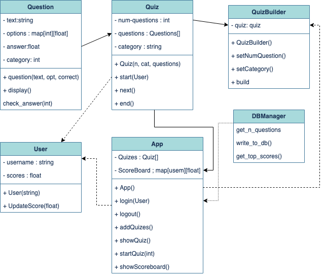
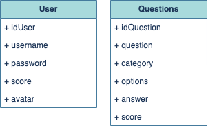
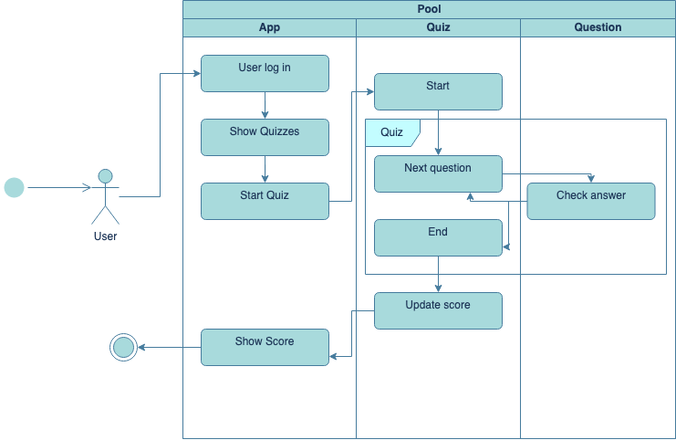

# Quiz-App

This is our final project for the Software Architecture class. ~~(We recommend reading in light mode)~~

## Link

[https://quiz-app-nu-jade.vercel.app/](https://quiz-app-nu-jade.vercel.app/)

## Team members

- [@Bastian1110](https://github.com/Bastian1110)
- [@HarumiManz](https://github.com/HarumiManz)
- [@GermanGuzmanLopez](https://github.com/GermanGuzmanLopez)
- [@Isabelinna](https://github.com/isabelinna)
- [@Marco Barbosa](https://github.com/A01746163)

## General overview

QuizApp is a web-based application designed to provide an interactive quiz experience for users. Quiz App allows users to test their knowledge on various topics by answering a set of questions. It incorporates features such as questions selection, feedback, score tracking and customization options to enhance the user experience.
Some of the features included are:

- Question Selection: The QuizApp allows users to choose the number of questions they want to answer. Additionally, users can select the category or topic of the quiz questions, providing them with the flexibility to focus on their preferred subjects.
- Interactive Question Display: The application displays each question one at a time in the browser window, ensuring a clear and focused user experience. The questions are presented in a visually appealing format, making it easy for users to read and comprehend.
- Feedback and Correct Answers: After the user answers a question, the QuizApp provides immediate feedback indicating whether the answer was right or wrong. If the user's choice was incorrect, the correct answer is displayed to enhance the user's knowledge and learning.
- Progression and Next Question: Once the user answers a question, they can proceed to the next question seamlessly. The application manages the flow of questions, ensuring a smooth and uninterrupted quiz experience.
- Score Tracking and Display: The QuizApp keeps track of the user's score throughout the quiz session. Once all questions have been answered, the final score is displayed to the user, giving them an overview of their performance.
- Score and Progress Saving: To enable users to track their progress over time, the QuizApp allows them to save their scores. This feature lets users review their performance history and observe improvements or areas that require more focus.

## Diagrams

#### Class Diagram

#### Database Diagram

#### Interaction Diagram

## Patterns used

This project incorporates various design patterns to ensure efficient implementation and maintainability. The following design patterns have been utilized:

### Singleton Pattern

The App and DBManager classes follow the Singleton pattern, ensuring that there is only a single instance of the class throughout the application. This design choice facilitates centralized access to the application's functionality and allows initialization with database information. The Singleton pattern enhances overall control and coordination of the system.

### Builder Pattern

To enable users to create their own quizzes, the Builder pattern has been employed. The QuizBuilder class serves as an interface for users to construct personalized quizzes. This pattern promotes a step-by-step construction approach and simplifies the creation of complex quiz structures. Users can dynamically build quizzes with ease and flexibility.

### Observer Pattern

Whenever there is a relevant change in the quiz (for example, a new question is presented), the Quiz object notifies all its observers, triggering an update or callback in the observing components. This update can then be used to refresh the user interface or update the scoreboard with the latest information.

### Decorator Pattern

In the showScoreboard and question methods, the Decorator pattern enhances the presentation of the question and the scores by adding additional functionality and style. Along with the logic, a decorator is applied before printing each question and rendering the users information. This pattern allows for dynamic augmentation of the elements appearance without modifying the core logic, resulting in a visually appealing and intuitive output.

By employing these design patterns, the project achieves a modular, extensible, and maintainable structure, promoting code reusability and separation of concerns.

## How to install and run the application

### Getting Started

To install The QuizApp follow these steps:

1. Clone the repository to your local machine.
2. Install the required dependencies by running `npm install`.
3. Install Tailwind CSS via npm ,follow the installation guide from [Tailwind](https://tailwindcss.com/docs/installation)
4. Create a .env file at the root of the project and add the necessary environment variables. You can find a list of required environment variables in the .env.example file.
5. Run the project by running npm run dev.
6. Visit http://localhost:3000 in your browser to see the application running.

### Development

When you're ready to deploy quizApp web page, you can use the built-in build command to generate a production-ready build of the project. To do this, simply run npm run build or yarn build. This will generate a build directory containing the optimized project files.

Once you've generated a production build, you can deploy your application using your preferred hosting provider or platform.
