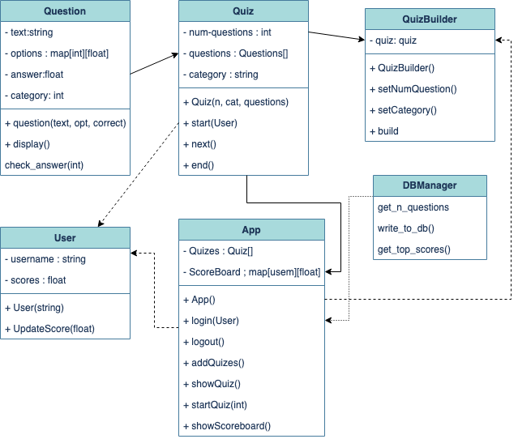
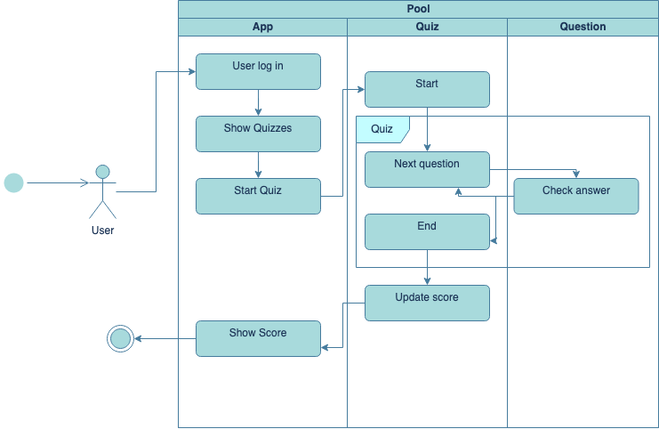

# Quiz-App

This is our final project for the Software Architecture class.

## Team members 
- [@Bastian1110](https://github.com/Bastian1110)
- [@HarumiManz](https://github.com/HarumiManz)
- [@GermanGuzmanLopez](https://github.com/GermanGuzmanLopez)
- [@Isabelinna](https://github.com/isabelinna)
- [@Marco Barbosa](https://github.com/A01746163)

## General overview
- 
## Diagrams 
- Class Diagram

- Database Diagram

- Interaction Diagram

## Patterns used
This project incorporates various design patterns to ensure efficient implementation and maintainability. The following design patterns have been utilized:

### Singleton Pattern
The App and DBManager classes follow the Singleton pattern, ensuring that there is only a single instance of the class throughout the application. This design choice facilitates centralized access to the application's functionality and allows initialization with database information. The Singleton pattern enhances overall control and coordination of the system.

### Builder Pattern
To enable users to create their own quizzes, the Builder pattern has been employed. The QuizBuilder class serves as an interface for users to construct personalized quizzes. This pattern promotes a step-by-step construction approach and simplifies the creation of complex quiz structures. Users can dynamically build quizzes with ease and flexibility.

### Decorator Pattern
In the showScoreboard and question methods, the Decorator pattern enhances the presentation of the question and the scores by adding additional functionality and style. Along with the logic, a decorator is applied before printing each question and rendering the users information. This pattern allows for dynamic augmentation of the elements appearance without modifying the core logic, resulting in a visually appealing and intuitive output.

By employing these design patterns, the project achieves a modular, extensible, and maintainable structure, promoting code reusability and separation of concerns.

## How to install and run the application
### Getting Started

To install The QuizApp follow these steps:

1. Clone the repository to your local machine.

2. Install the required dependencies by running npm install.

3. Install Tailwind CSS via npm ,follow the installation guide from [Tailwind](https://tailwindcss.com/docs/installation)

4. Create a .env file at the root of the project and add the necessary environment variables. You can find a list of required environment variables in the .env.example file.

4. Run the project by running npm run dev.

5. Visit http://localhost:3000 in your browser to see the application running.

### Development

When you're ready to deploy quizApp web page, you can use the built-in build command to generate a production-ready build of the project. To do this, simply run npm run build or yarn build. This will generate a build directory containing the optimized project files.

Once you've generated a production build, you can deploy your application using your preferred hosting provider or platform.

## Acknowledgments and References
- 
